# 基于Java+SpringBoot+Vue大学生实习管理系统(源码+数据库)

#### 作者QQ：3275035005 微信：xkbishe123 (支持修改、 部署调试、 代做接毕业设计和课程设计)

#### 网站建设、小程序、H5、APP、各种系统、样式修改、10000套源码可选。

#### 选题+开题报告+任务书+程序定制+安装调试+论文+答辩ppt 都可以做

#### 问题包修改，包满意，有需求尽管甩过来！一条龙帮你安心过！

#### 所有项目以及源代码本人均调试运行无问题 可支持远程调试运行

# 项目介绍
基于Java+SpringBoot+Vue大学生实习管理系统-毕业设计，本系统分为学生、管理员、导师项目采用前后端分离开发。

可选题目：大学生实习管理系统、高校实习管理系统、学校实习管理系统

### 1. 学生

登录、查看首页信息、查看实习信息、填写实习信息、修改实习信息、查看周记、添加周记、填写实现报告、修改密码、修改个人信息、退出登录。

### 2. 导师

登录、查看首页信息、查看实习信息、修改实习状态、查看实习报告、查看实习周记、评价分数、修改密码、修改个人信息、退出登录。

### 3. 管理员

登录、查看首页信息、专业信息管理、班级信息管理、用户管理、修改密码、修改个人信息、退出登录。

# 技术框架
- 开发语言：Java
- 数据库：Mysql5.7以上
- 系统环境：jdk8、maven、node
- 后端框架：SpringBoot、MyBatis
- 前端框架：Vue、ElementUI
- 工具：IDEA、Navicat
- 技术架构：前后端分离、B/S架构、MVC架构
# 项目截图

### 1. 学生端

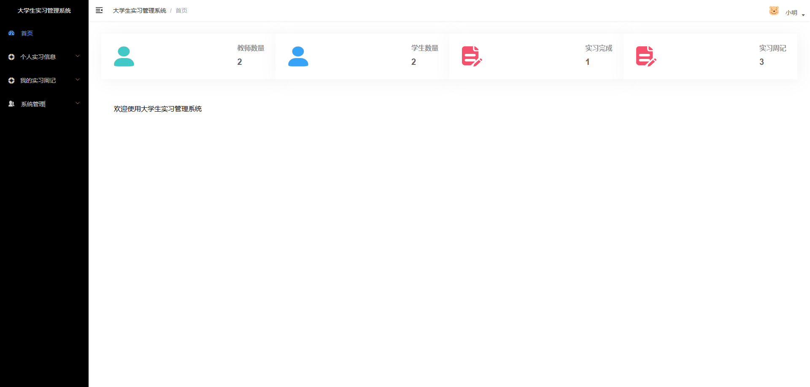

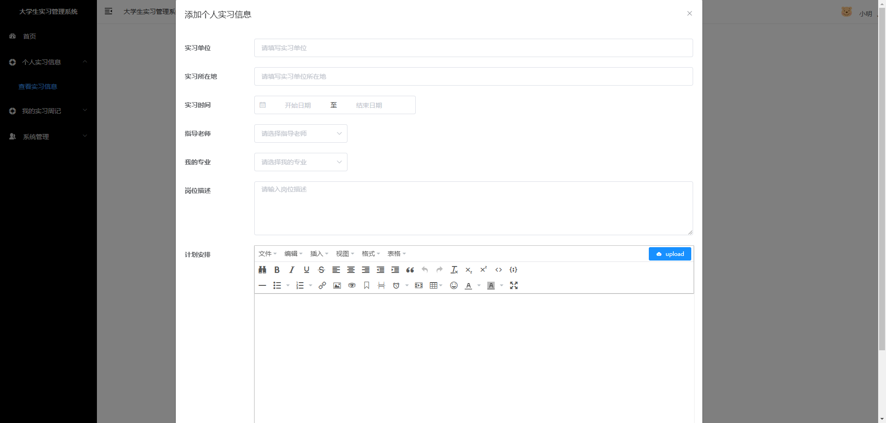

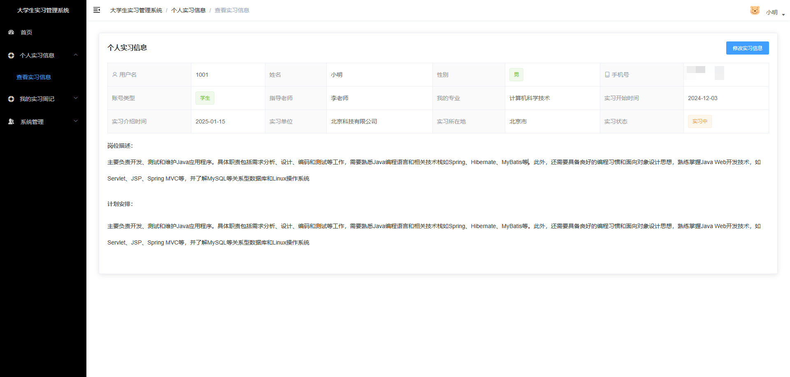

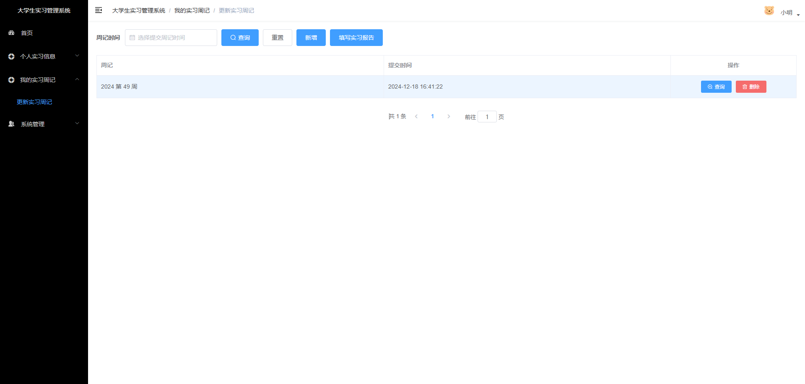

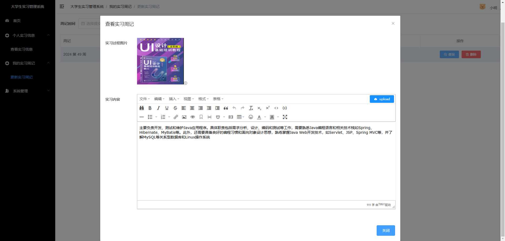

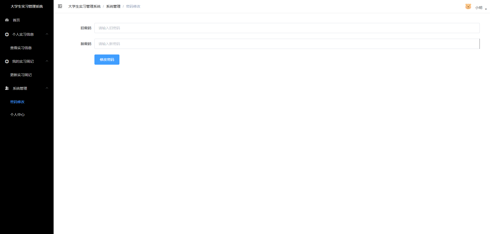

### 2. 管理员端

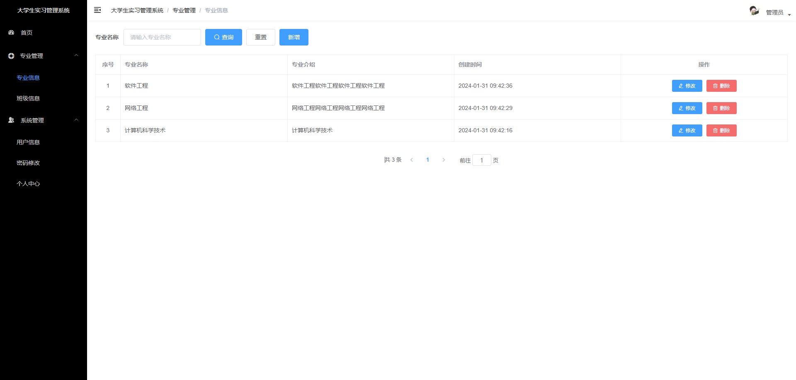

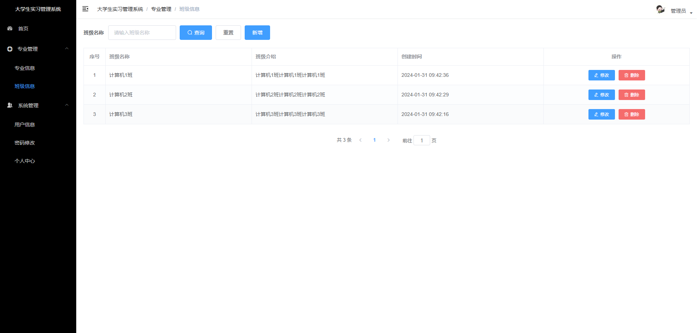

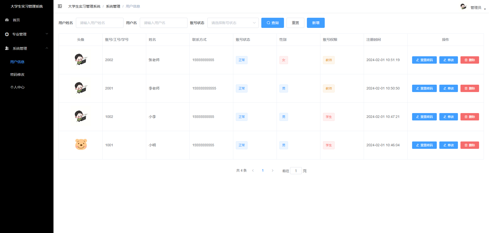

### 3. 导师端

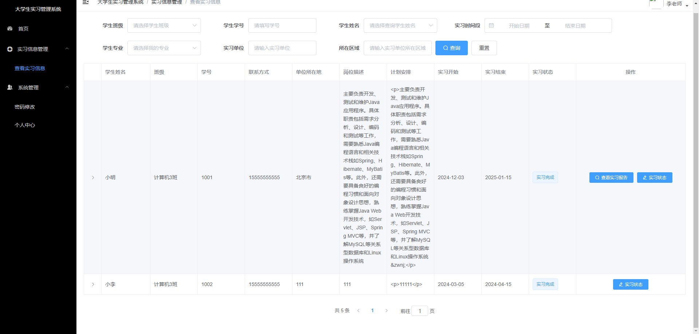

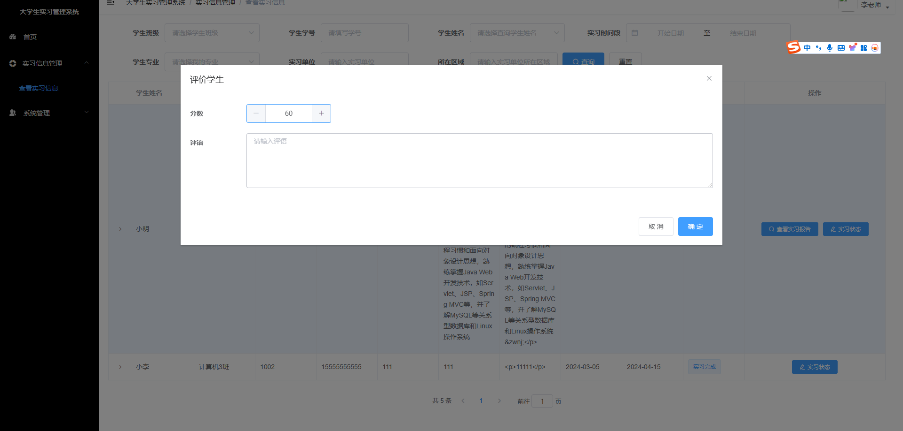

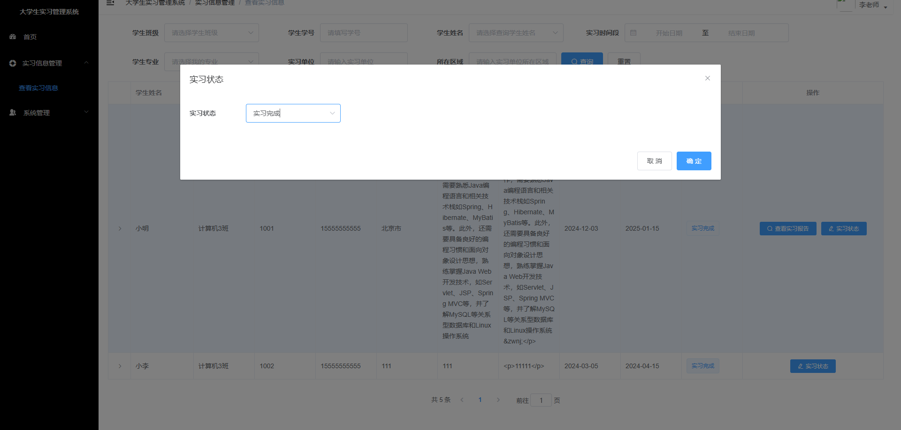

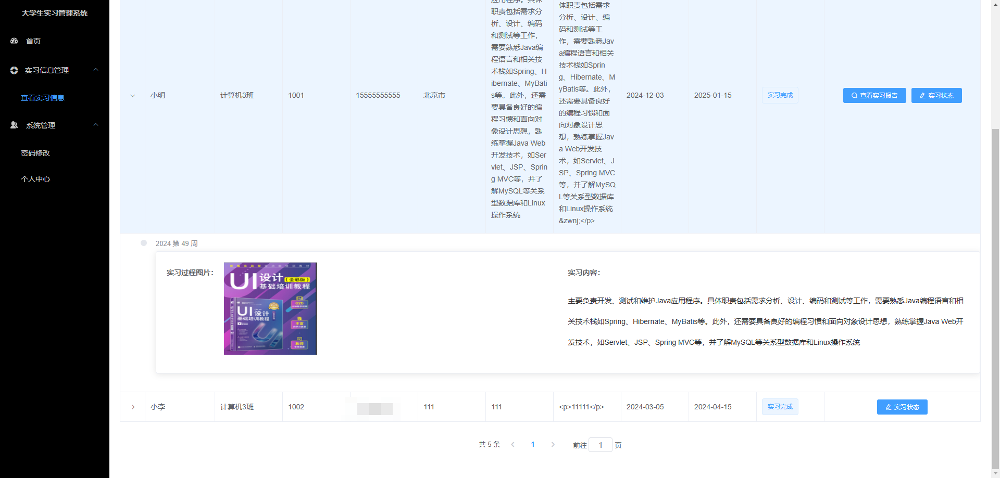
